# My Clients

<h1>Project Time</h1>
Time  : MMT 
Development Start : Feb 2 2024 11:00 AM 
Development End   : Feb 2 2024 06:30 PM   
Documation and screenstoots 
Start : Feb 2 2024 06:30 AM 
End   : Feb 2 2024 09:30 PM   

<h1>Project Notes</h1>
 
 State Management                : provider: ^6.0.5  
 local databse (android and ios) : sembast: ^3.5.0+1 
 local databse (web)             : sembast_web: ^2.2.0  
 Route Management                : go_router: ^12.1.0 
 Theme                           : theme_manager: 1.1.1 
 Responsive                      : custom resposive with MediaQuery width size 
 Width and hight(Dimensions)     : Dimensions are created using MediaQuery screenHeight and screenWidth for responsive font,with,hight and redius  

I have done Requirement 1 and 2. 
I use my Quality and best practices. 
I create app using Dimensions and responsive for designs and look on different devices. 
I load 1000 clients from local json on loading screen and add to databse and than i tested for search in 1000 data 
it's fine.   

I didn't have much time for assigment because I am in project lunch in my company so I did my best in this time. 
This project is not that much hard for me. If I have more time, I can add more function.   

Features I haven't done  

- language support  
- recent search  

<h1>Andriod mobile phone Screens </h1>

1.Home  
 

2.Home Search  
 

3.Client Create  
 

4.Client Create 2  
 

5.Client Edit  
 

6.Client Edit 2  
 

7.Delete Confirm  
 

<h1> ios mobileScreens </h1>

1.Home  
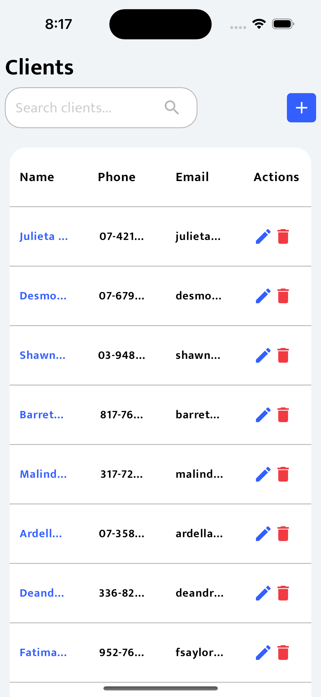 

2.Home Search  
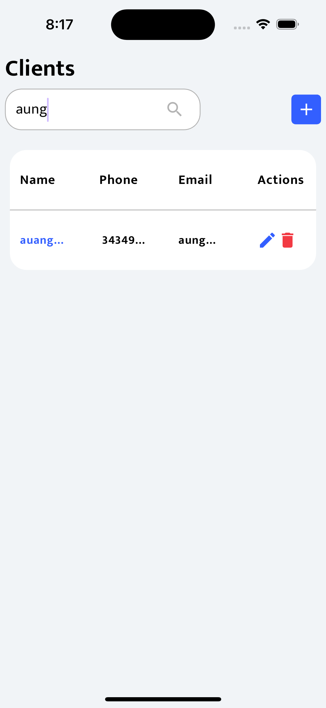 

3.Client Create  
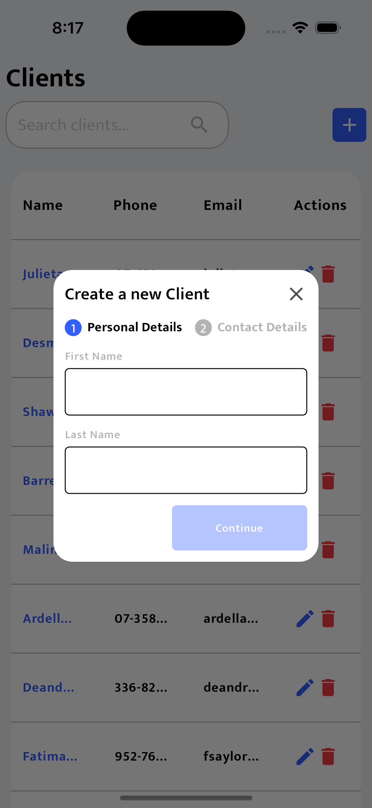 

4.Client Create 2  
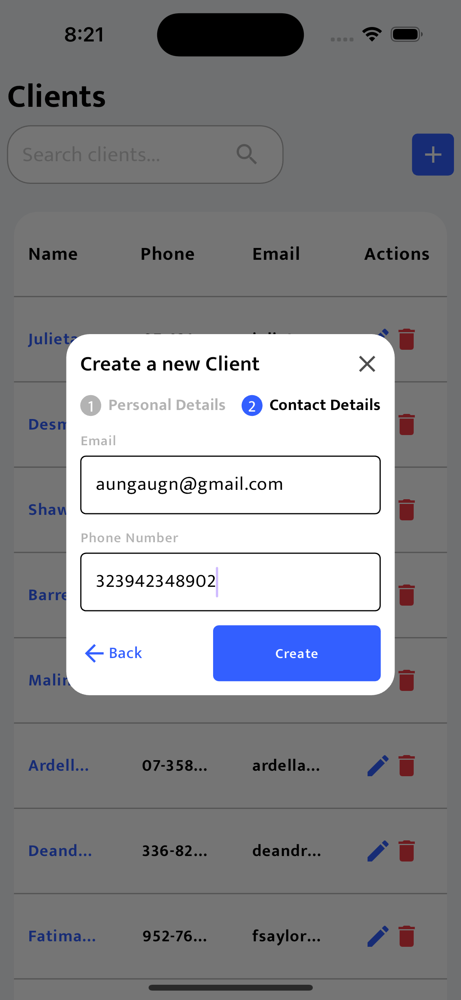 

5.Client Edit  
 

6.Client Edit 2  
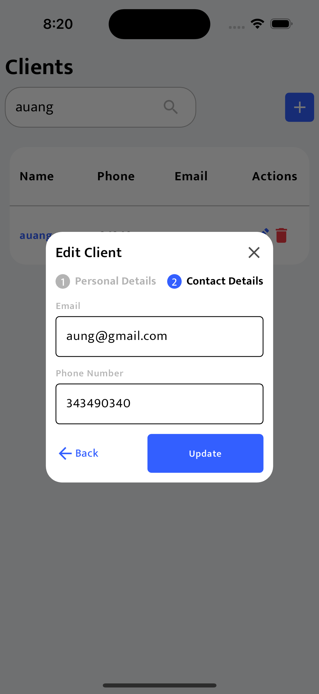 

7.Delete Confirm  
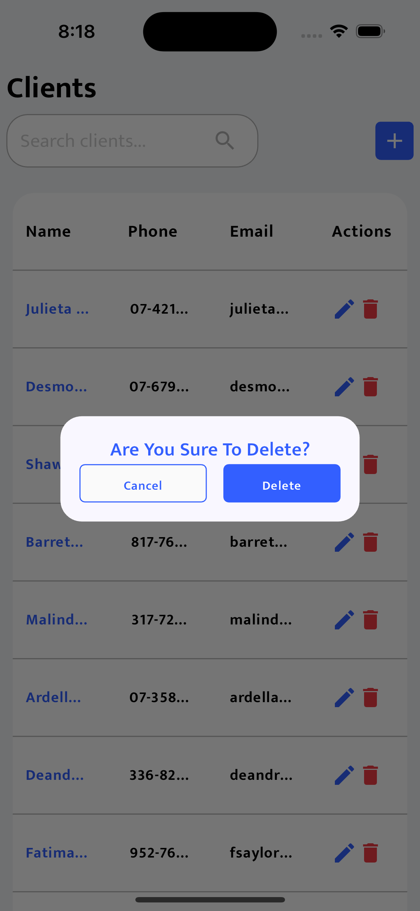 

<h1>Websites Screens </h1>

1.Home  
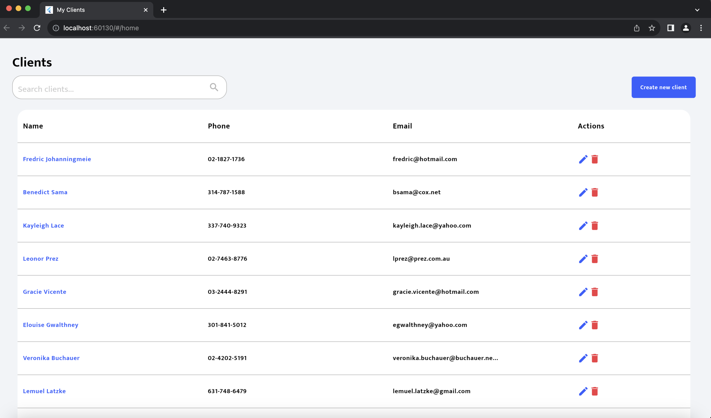 

2.Home Search  
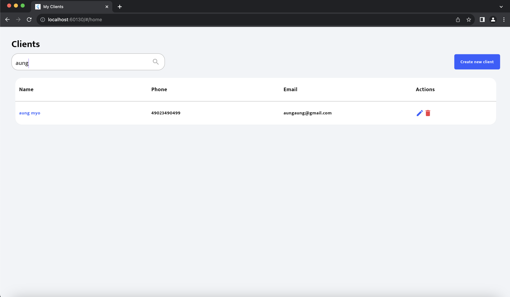 

3.Client Create  
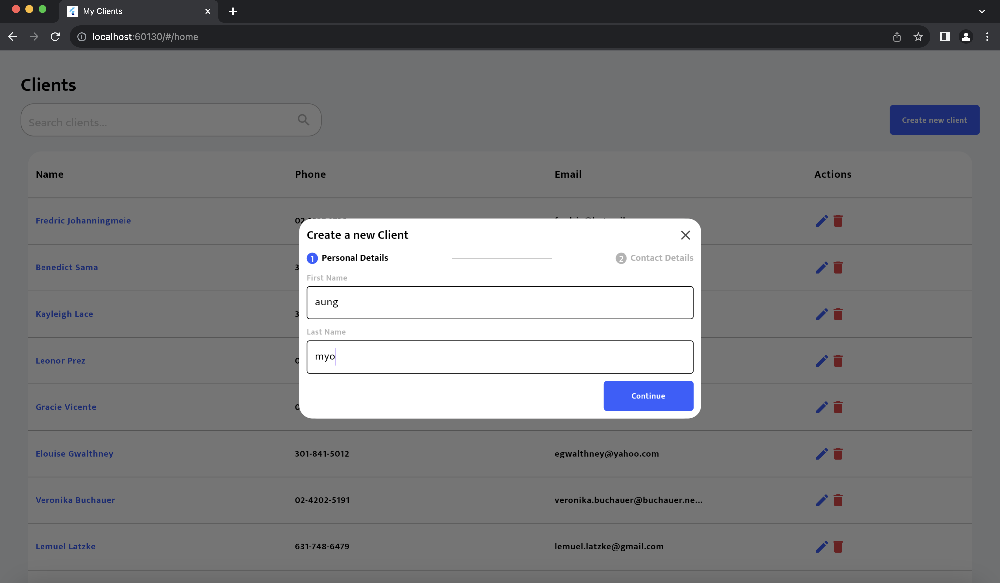 

4.Client Create 2  
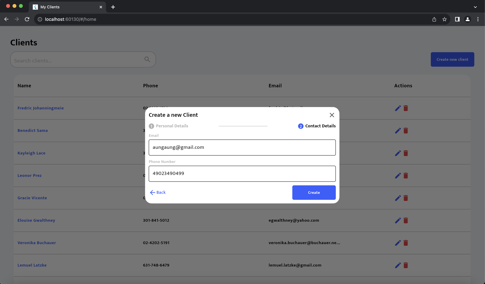 

5.Client Edit  
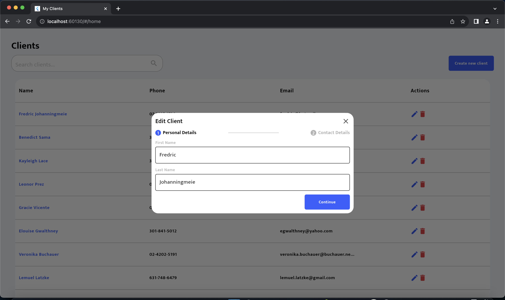 

6.Client Edit 2  
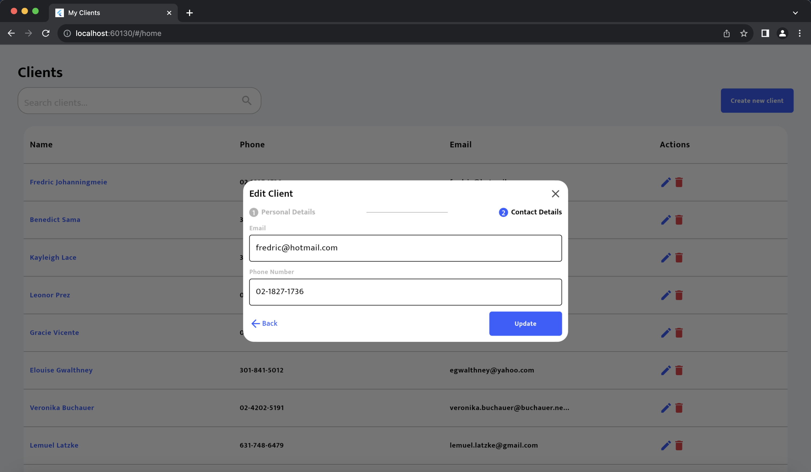 

7.Delete Confirm  
 

<h1>Andriod mobile tablet Screens </h1>

1.Home  
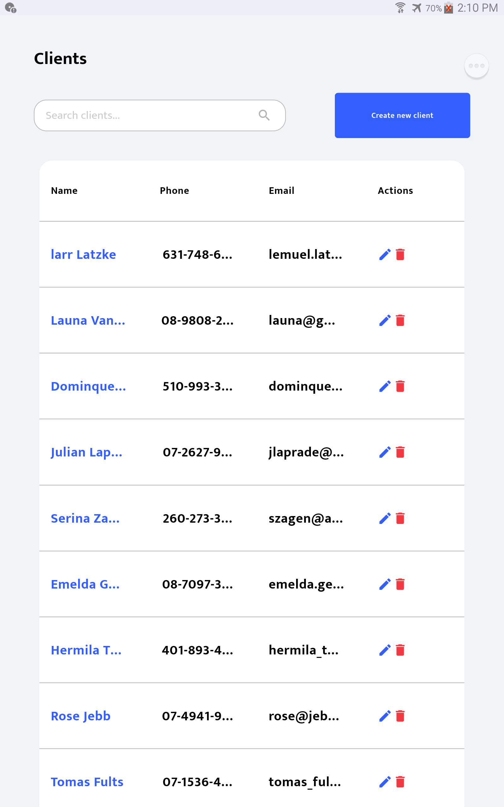 

2.Home Search  
 

3.Client Create  
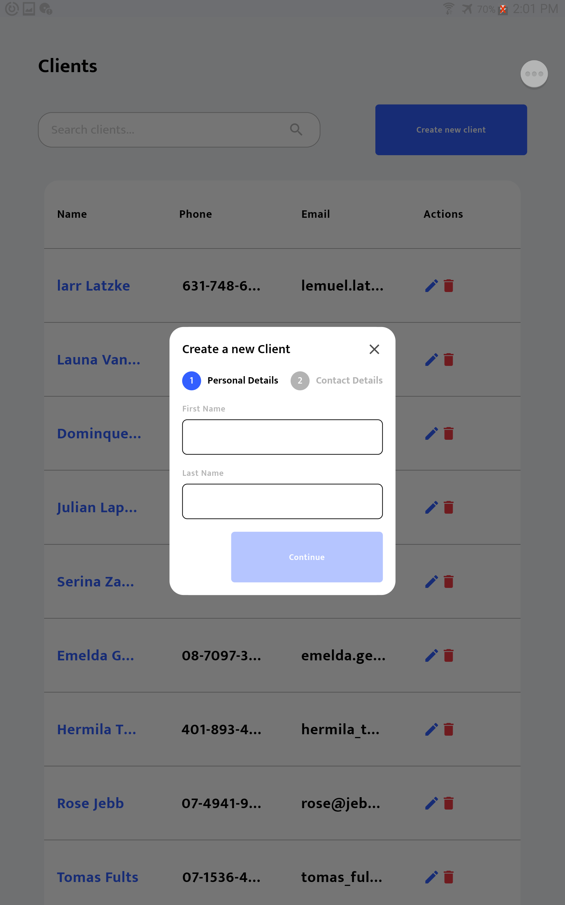 

4.Client Create 2  
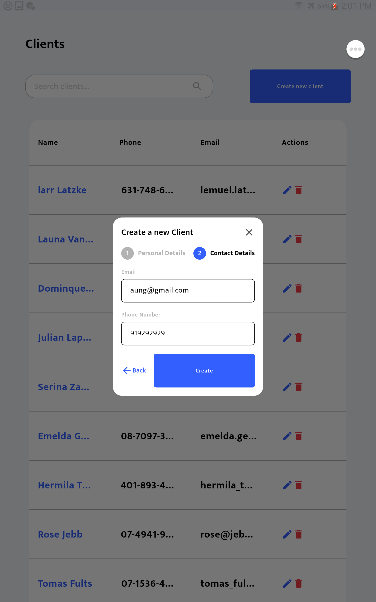 

5.Client Edit  
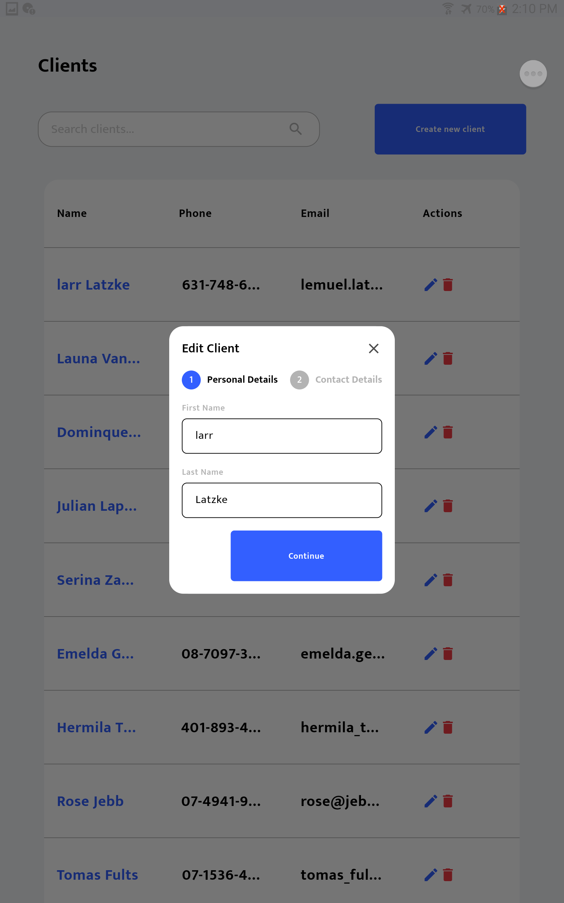 

6.Client Edit 2  
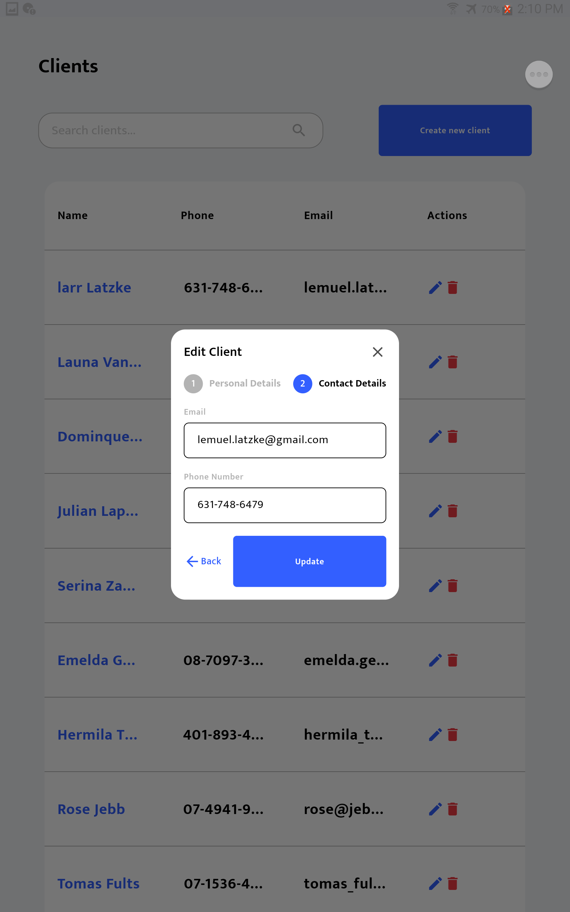 
