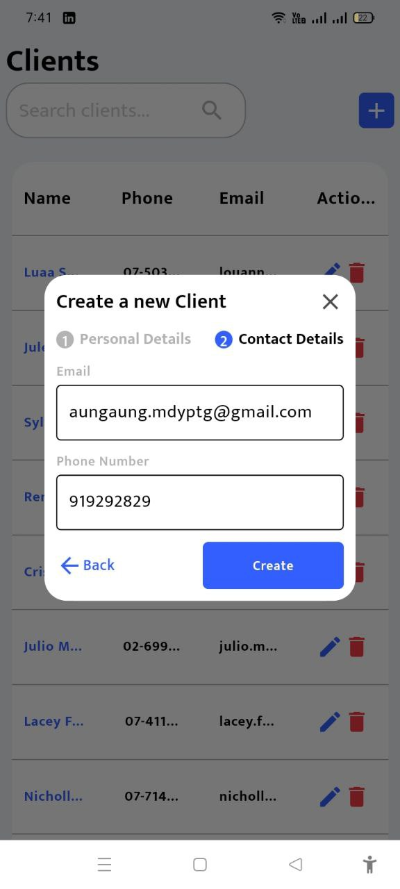
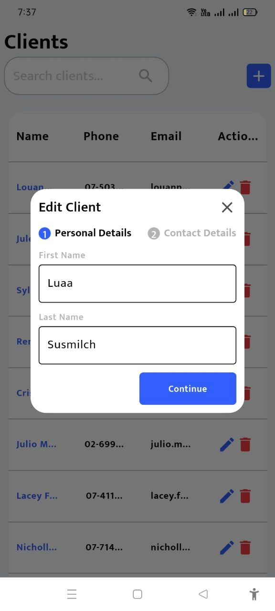

# My Clients

<h1>Andriod mobile phone Screens </h1>

1.Home  
 

2.Home Search  
 

3.Client Create  
 

4.Client Create 2  
 

5.Client Edit  
 

6.Client Edit 2  
 

7.Delete Confirm  
 

<h1> ios mobileScreens </h1>

1.Home  
 

2.Home Search  
 

3.Client Create  
 

4.Client Create 2  
 

5.Client Edit  
 

6.Client Edit 2  
 

7.Delete Confirm  
 

<h1>Websites Screens </h1>

1.Home  
 

2.Home Search  
 

3.Client Create  
 

4.Client Create 2  
 

5.Client Edit  
 

6.Client Edit 2  
 

7.Delete Confirm  
 

<h1>Andriod mobile tablet Screens </h1>

1.Home  
 

2.Home Search  
 

3.Client Create  
 

4.Client Create 2  
 

5.Client Edit  
 

6.Client Edit 2  
 

7.Delete Confirm  
 

