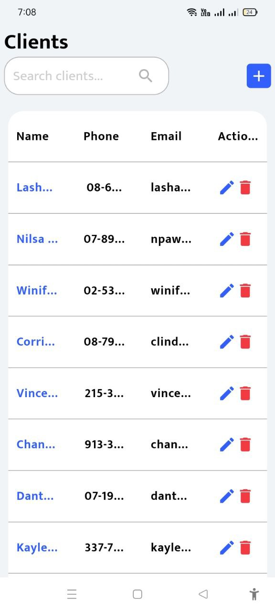
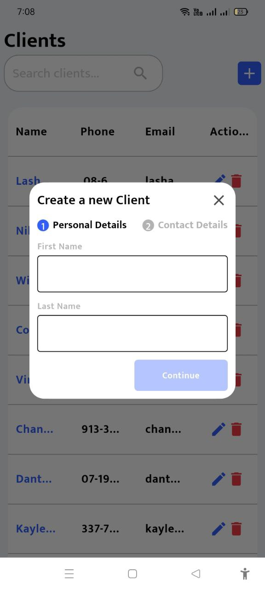
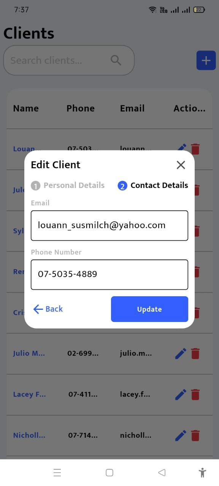
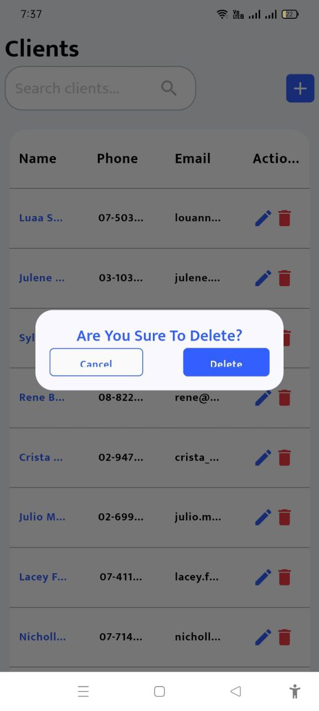
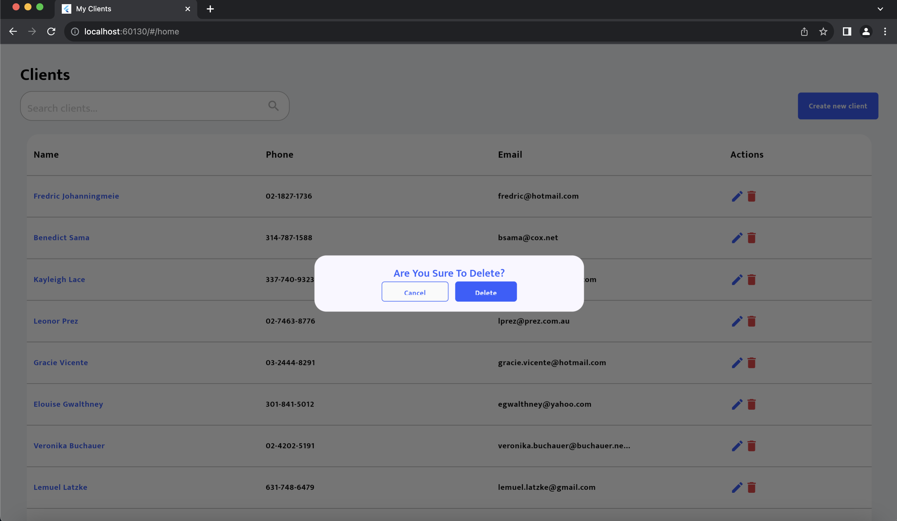

# My Clients

<h1>Project Time</h1>
Time  : MMT 
Development Start : Feb 2 2024 11:00 AM 
Development End   : Feb 2 2024 06:30 PM   
Documation and screenstoots 
Start : Feb 2 2024 06:30 AM 
End   : Feb 2 2024 09:30 PM   
I didn't have much time for assigment because I am in project lunch in my company so I did my best in this time. 

<h1>Andriod mobile phone Screens </h1>

1.Home  
 

2.Home Search  
 

3.Client Create  
 

4.Client Create 2  
 

5.Client Edit  
 

6.Client Edit 2  
 

7.Delete Confirm  
 

<h1> ios mobileScreens </h1>

1.Home  
 

2.Home Search  
 

3.Client Create  
 

4.Client Create 2  
 

5.Client Edit  
 

6.Client Edit 2  
 

7.Delete Confirm  
 

<h1>Websites Screens </h1>

1.Home  
 

2.Home Search  
 

3.Client Create  
 

4.Client Create 2  
 

5.Client Edit  
 

6.Client Edit 2  
 

7.Delete Confirm  
 

<h1>Andriod mobile tablet Screens </h1>

1.Home  
 

2.Home Search  
 

3.Client Create  
 

4.Client Create 2  
 

5.Client Edit  
 

6.Client Edit 2  
 
